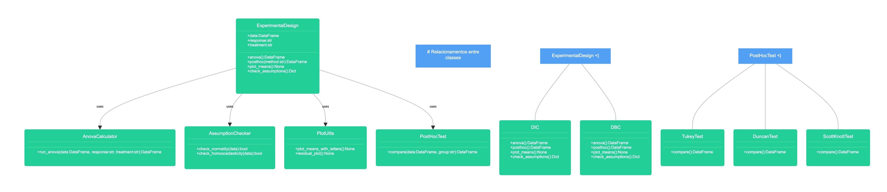

# expdespy

**expdespy** is a Python package for statistical analysis of experimental designs.

## Features

- Completely Randomized Design (DIC)
- Randomized Block Design (DBC)
- Split-Plot Design
- ANOVA
- Assumption checks
- Post-hoc tests: Tukey, Duncan, Scott-Knott
- Visualizations with significance letters

## Install

```bash
pip install .
```

## Usage

```python
from expdespy.models import DIC
dic = DIC(data=df, response="yield", treatment="fertilizer")
dic.anova()
dic.tukey()
dic.plot_means()
```

<!-- /Users/cristianooliveira/Documents/expdespy/src/estrutura_projeto.png -->

## UML


## License

MIT
